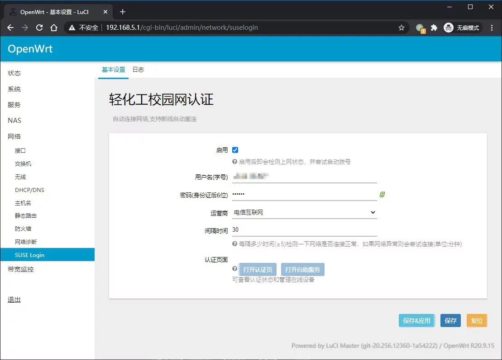
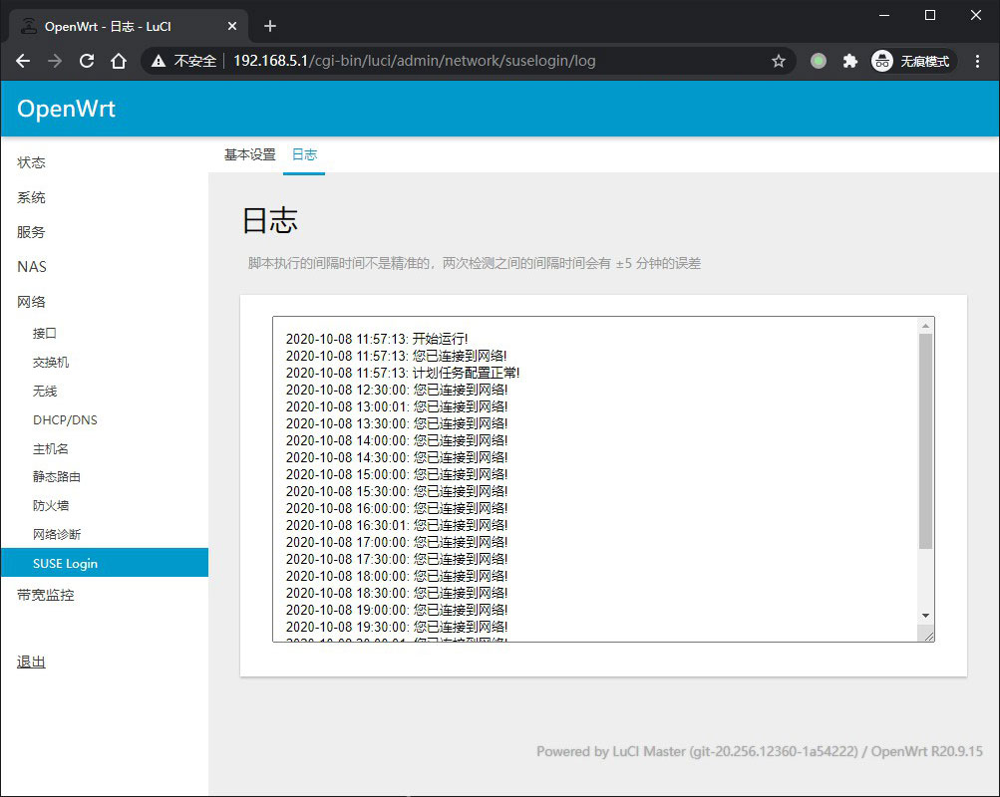

# luci-app-suselogin

适用于 [四川轻化工大学](http://www.suse.edu.cn/) [锐捷网络](http://www.ruijie.com.cn/) Web 网络认证系统，可以自动连接网络，也可以通过设定的时间检测网络连接状态并自动重连。





## 快速开始

前往 Releases 下载已编译好的 ipk https://github.com/blackyau/luci-app-suselogin/releases/latest

在 OpenWrt - 系统 - 文件传输 选择该 ipk 点击上传，然后在下方安装。


安装完毕后在 网络 - SUSE Login 点击**启用**并填入**用户名**和**密码**选择你的**运营商**后点击右下方的**保存&应用**，查看日志当提示**登录成功**时说明已登录成功。

如果提示缺少依赖，那么还需要安装 `curl`，请使用 Xshell 之类的软件连接到路由器，然后执行以下命令安装 `curl` 。

```shell
opkg update
opkg install curl
```

## 手动编译

请查看 https://github.com/coolsnowwolf/lede 你必须要先知道如何编译正常的固件，才会在编译的过程中加入该扩展。

```shell
cd lede/package  # 进入 OpenWrt 源码的 package 目录
git clone https://github.com/blackyau/luci-app-suselogin.git  # 下载插件源码
cd ..  # 返回 OpenWrt 源码主目录
make menuconfig  # 进入编译设置菜单
```

LuCI ---> Applications ---> luci-app-suselogin

将其选中，使得复选框变为 <*> 再保存编译设置，随后正常编译即可。固件会自带 `luci-app-suselogin`

```shell
make -j8 download
make -j$(($(nproc) + 1)) V=s
```

编译前建议将 `package/base-files/files/bin/config_generate` 里面的 `generate_static_system()` 添加一项 `set system.@system[-1].cronloglevel='9'` 可以让 crontab 的日志只打印错误信息，不打印每次执行时的日志，避免污染系统日志。

## 实现细节

当插件设置为启用后，会在 crontab 中写入一个每隔 5 分钟运行一次的脚本。该脚本会记录最近一次登录成功的时间，当它执行时会获取当前时间，并且与上一次运行的时间进行比较，如果间隔时间大于设定值，则会检测登录状态，如果未连接到互联网则会尝试登录。

最近登录时间储存位置: `/tmp/log/suselogin/last_time`

发送登录请求返回数据: `/tmp/log/suselogin/login.log`

完整日志: `/tmp/log/suselogin/suselogin.log`

## 注意

本扩展依赖于 crontab，请在 系统 - 计划任务 编辑 crontab 文件时，不要删除里面的

```
*/5 * * * * /usr/lib/suselogin/login.sh
```

本扩展在添加删除任务时，不会影响其他 crontab 任务。

## 参考

- [GitHub@coolsnowwolf - Lean’s OpenWrt source](https://github.com/coolsnowwolf/lede)
- [博客园@大魔王mAysWINd - 开发OpenWrt路由器上LuCI的模块](https://www.cnblogs.com/mayswind/p/3468124.html)
- [Github@OpenWrt - luci WIKI](https://github.com/openwrt/luci/wiki/CBI)
- [目录@陈浩南 - 在厦大宿舍安装路由器](https://catalog.chn.moe/%E6%95%99%E7%A8%8B/OpenWrt/%E5%9C%A8%E5%8E%A6%E5%A4%A7%E5%AE%BF%E8%88%8D%E5%AE%89%E8%A3%85%E8%B7%AF%E7%94%B1%E5%99%A8/)
- [OpenWrt@Documentation - System configuration /etc/config/system](https://openwrt.org/docs/guide-user/base-system/system_configuration)
- [OpenWrt@Documentation - Init Scripts](https://openwrt.org/docs/techref/initscripts)
- [askubuntu@Greg Hanis - How to remove or delete single cron job using linux command?
](https://askubuntu.com/questions/408611)
- [stackoverflow@dchakarov - Create timestamp variable in bash script](https://stackoverflow.com/questions/17066250)
- [stackoverflow@Joe Casadonte - How do I create a crontab through a script](https://stackoverflow.com/questions/4880290)
- [stackoverflow@user0000001 - Search for a cronjob with crontab -l](https://stackoverflow.com/questions/14450866)
- [知乎@Maxwell - 如何优雅地创建重定向路径中不存在的父目录](https://zhuanlan.zhihu.com/p/61890472)
- [博客园@程默 - linux shell 时间运算以及时间差计算方法](https://www.cnblogs.com/chengmo/archive/2010/07/13/1776473.html)

## License

Copyright 2020 BlackYau <blackyau426@gmail.com>

GNU General Public License v3.0
